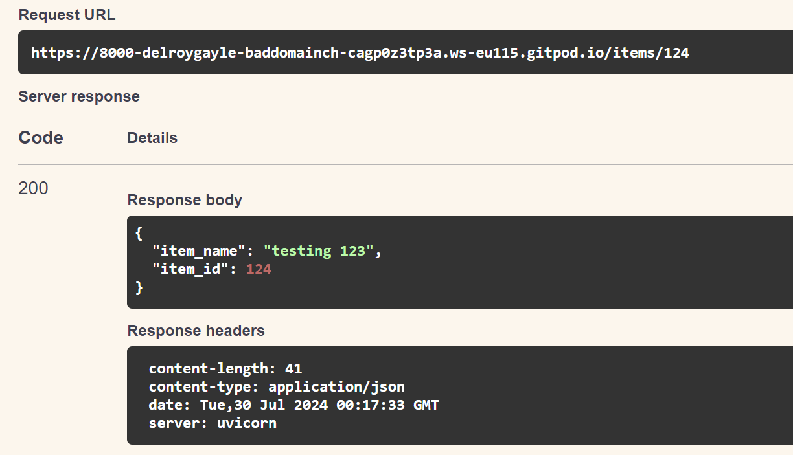

# RE my1st.py

Experimented by entering<br>
```fastapi dev fastapi_experimentation/my1st.py```

Sample output:<br>

```
https://8000-delroygayle-baddomainch-cagp0z3tp3a.ws-eu115.gitpod.io/
==>
{"Hello":"World"}
OR PRETTY PRINT:
{
  "Hello": "World"
}

https://8000-delroygayle-baddomainch-cagp0z3tp3a.ws-eu115.gitpod.io/items/5
{"item_id":5,"q":null}
OR PRETTY PRINT:
{
  "item_id": 5,
  "q": null
}

https://8000-delroygayle-baddomainch-cagp0z3tp3a.ws-eu115.gitpod.io/items/5?q=searchquery
{"item_id":5,"q":"searchquery"}
```

# Docs
https://8000-delroygayle-baddomainch-cagp0z3tp3a.ws-eu115.gitpod.io/docs produced an automatic interactive API documentation as described in the FASTAPI documentation

https://8000-delroygayle-baddomainch-cagp0z3tp3a.ws-eu115.gitpod.io/redoc produced an alternative automatic documentation as provided by [ReDoc](https://github.com/Rebilly/ReDoc)


# RE my2nd.py

Experimented by entering<br>
```fastapi dev fastapi_experimentation/my2nd.py```

Sample output:<br>

```
https://8000-delroygayle-baddomainch-cagp0z3tp3a.ws-eu115.gitpod.io/
==>
{"Hello":"World"}
```

# TEST PUT ENDPOINT
**Entered the following**<br>


**which produced**



# TEST GET ENDPOINT
**In turn, the GET Endpoint retrieved the correct item:**


